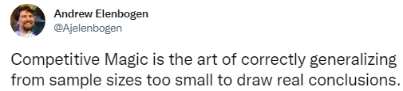

### On Phoenix in Pioneer Redux

#### _2022-05-27_

Four months ago I wrote  "On Phoenix in Pioneer" after going 3-2 with the deck in a Showcase Qualifier. Looking back on that piece and reflecting on the process that led to me qualifying for the MOCS I can see that my understanding of the deck has drastically changed since then and in this essay I will cover that process as well my current understanding of the deck.

**Frameworks**

While Magic contains a large number of subgames which are interesting in their own right, they can really all be reduced down to the accuracy of players models being stress-tested against each other. This is perhaps too broad a view to be really useful but from there I specifically tend to look at these models through the lens of weights or multipliers in an attempt to port machine learning frameworks. The importance assigned to granular inputs eventually merges into a cohesive model and as we are exposed to more training data we are able to refine these multipliers and hopefully improve the accuracy of the models they are components in. You can "autopilot" through games because you have these multipliers under the hood but this is happening everywhere ([see](https://slatestarcodex.com/2016/09/12/its-bayes-all-the-way-up/) [the](https://slatestarcodex.com/2017/09/05/book-review-surfing-uncertainty/) [large](https://slatestarcodex.com/2017/09/06/predictive-processing-and-perceptual-control/) [amounts](https://slatestarcodex.com/2017/09/12/toward-a-predictive-theory-of-depression/) [of](https://slatestarcodex.com/2018/03/04/god-help-us-lets-try-to-understand-friston-on-free-energy/) literature on predictive processing from Scott alone) and we only stand to benefit from being conscious of that fact.

I truly do believe that the tightness of fit between these weights of yours and reality is the best predictor for finding success in Magic and this does a lot to keep my grounded in what I am trying to accomplish. I'm not trying to win games and I'm not even really trying to develop 
understanding of formats or decks. The goal, as hard as it is to achieve, is improving the frameworks around doing the items mentioned previously. If we look at the best players they are consistently able to come in, and at least against players worse than themselves, put out high quality games even on minimal reps. Part of this is obviously the fact that they have colossal datasets to draw on, but especially in the modern era of Modern Horizon and F.I.R.E. driven power creep historical data maps only so well to the current day and what I think is far more important is their ability to create new and relatively high fidelity models almost on the fly.

What I'm trying to get at here is that my attitude towards Magic is primarily driven by Rationalist literature. Having stripped away a lot of the fluff and loosely redefined the game to being about optimizing models and optimizing the process of optimizing models the connection seems very apparent to me. In talking with better players than myself I keep getting echoes of Rationalist rhetoric and I believe that having been exposed to a large, focused dose of such accounts for a large portion of any edge I may have. It's hard to say how meaningful this is coming from me who would be hard pressed to identify a field I would not draw this connection to but really what I am trying to do here is get more clarity on my view of the game I invest so much effort into by putting it to paper before zooming in on the specifics of Pioneer Phoenix

**Is our Children Learning?**

Ever since I first got into Pioneer with Bant Spirits at the start of the pandemic the format has been drastically underexplored. In general, the incentivizes to innovate and put critical though into the game are largely dead but this is obviously exacerbated in smaller formats like Pioneer. As one of the few guys dumb enough to sink a lot of time into it I ended up doing relatively well first by jumping between options like Niv to Light and Jund to exploit the highly predictable cycles of top Goldfish results being copied and then by, I believe, doing a good job identifying and tuning the strongest decks in the format. My work on Ascendancy and Phoenix is what I am referring to with the second half of the prior statement and in fact my jump from the former to the latter driven by the eventual conclusion that Ascendancy is too inconsistent is a great example of what I think I am doing right. I understand the general metagame fluctuating week by week in a fashion that is almost entirely decoupled from the strength of decks being played but the fact that I was one of only three players to register Phoenix is still baffling to me as I naively do expect better from people passing through that initial filter.

Allen Wu touches on this in his [PTF Report](https://article.hareruyamtg.com/article/43190/?lang=en)saying "The most pervasive mistake that Magic players make is getting stuck on best plays that aren’t actually best, without ever trying the alternatives". This also cleanly maps and I would argue is an even bigger issue for many players in how it relates to deck choice. The predictive power of scouting sheets based on Goldfish histories for MOCS qualifier events is a huge red flag that something has gone wrong. For me lack of confidence in past Andrei is typically enough of a motivator to explore new options but even if that doesn't ring true in your case you should still aim to be more greedy and less predictable in deck selection.

**Birds!**

But enough of that, let's talk about Phoenix. The deck is just extremely good. Delve spells coupled with Expressive Iteration feed you enough card advantage that can do a lot of suboptimal things with it and still come out ahead. Case in point being UR control and more recently Prowess. Prowess is certainly the better deck of the two but I believe is still an example of people choosing to make their UR shell worse than it could be. Going over the top with Turns and "free" Phoenixes is just a lot more robust than playing creatures that die to removal. 

Bashing of Prowess gamers aside, I think that what defines the deck is playing enough interaction to not die while executing your combo in game one and then shifting into a much less combo oriented, middle of the road configuration postboard. Dedicated hate pieces are actually something I am often happy to see because they put our opponent down a card when we already outpace them on card advantage and because we can often just ignore it. The injection of Unlicensed Hearse into the format is something an exception to that with how strong the card is but even then until people start playing much more of it than they are right now I believe we can mostly shrug it off. The addition of Ledger Shredder makes this all the easier by giving us another very robust alternate threat.

Beyond that I surprisingly don't feel that there is much to say about the deck itself. I find that this core model informs almost everything about my play with it. I suppose I can look forward to seeing what innovation the Pro Tour will bring to the archetype and format as a whole.

[Home]({{ site.url }}/)
